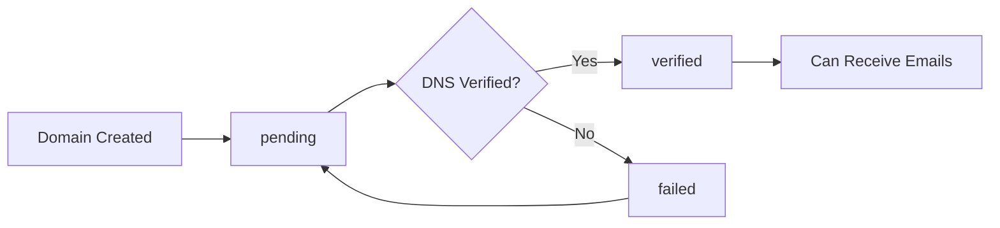

## Overview

Domains are the foundation of email receiving in Inbound. Before you can create email addresses, you need to add and verify a domain. Inbound uses AWS SES for email receiving, which requires DNS record verification and MX record configuration.

<Info>
Every domain in Inbound goes through a verification process:
1. Add the domain to Inbound
2. Add DNS records (TXT, MX, DKIM, SPF, DMARC)
3. AWS SES verifies the records
4. Domain becomes active and can receive emails
</Info>

## Schema Definition

From the database schema (`lib/db/schema.ts:72-99`):

```typescript
export const emailDomains = pgTable('email_domains', {
  id: varchar('id', { length: 255 }).primaryKey(),
  domain: varchar('domain', { length: 255 }).notNull().unique(),
  status: varchar('status', { length: 50 }).notNull(), // 'pending', 'verified', 'failed'
  verificationToken: varchar('verification_token', { length: 255 }),
  canReceiveEmails: boolean('can_receive_emails').default(false),
  hasMxRecords: boolean('has_mx_records').default(false),
  domainProvider: varchar('domain_provider', { length: 100 }),
  providerConfidence: varchar('provider_confidence', { length: 20 }),
  lastDnsCheck: timestamp('last_dns_check'),
  lastSesCheck: timestamp('last_ses_check'),
  
  // MAIL FROM domain (removes "via amazonses.com")
  mailFromDomain: varchar('mail_from_domain', { length: 255 }),
  mailFromDomainStatus: varchar('mail_from_domain_status', { length: 50 }),
  mailFromDomainVerifiedAt: timestamp('mail_from_domain_verified_at'),
  
  // Catch-all configuration
  isCatchAllEnabled: boolean('is_catch_all_enabled').default(false),
  catchAllEndpointId: varchar('catch_all_endpoint_id', { length: 255 }),
  catchAllReceiptRuleName: varchar('catch_all_receipt_rule_name', { length: 255 }),
  
  // DMARC reporting
  receiveDmarcEmails: boolean('receive_dmarc_emails').default(false),
  
  tenantId: varchar('tenant_id', { length: 255 }), // SES tenant isolation
  createdAt: timestamp('created_at').defaultNow(),
  updatedAt: timestamp('updated_at').defaultNow(),
  userId: varchar('user_id', { length: 255 }).notNull(),
});
```

## Domain Status Lifecycle



### Status Values

- **`pending`** - Domain created, waiting for DNS verification
- **`verified`** - DNS records verified, can receive emails
- **`failed`** - Verification failed, check DNS records

## Adding a Domain

### Using the SDK

```typescript
import { Inbound } from 'inboundemail'

const inbound = new Inbound(process.env.INBOUND_API_KEY!)

// Add a domain
const domain = await inbound.domains.create({
  domain: 'yourdomain.com'
})

console.log(domain)
// {
//   id: 'dom_abc123',
//   domain: 'yourdomain.com',
//   status: 'pending',
//   canReceiveEmails: false,
//   hasMxRecords: false,
//   dnsRecords: [
//     {
//       type: 'TXT',
//       name: '_amazonses.yourdomain.com',
//       value: 'amazonses:ABCxyz123...',
//       description: 'AWS SES verification record',
//       isRequired: true
//     },
//     {
//       type: 'MX',
//       name: 'yourdomain.com',
//       value: '10 inbound-smtp.us-east-2.amazonaws.com',
//       description: 'Email receiving MX record',
//       isRequired: true
//     },
//     // DKIM records...
//   ]
// }
```

### Direct API Request

From the implementation (`app/api/e2/domains/create.ts:81-524`):

```bash
curl -X POST https://inbound.new/api/e2/domains \
  -H "Authorization: Bearer ${INBOUND_API_KEY}" \
  -H "Content-Type: application/json" \
  -d '{
    "domain": "yourdomain.com"
  }'
```

<Note>
The API automatically:
- Validates the domain format
- Checks for conflicts with existing domains
- Initiates AWS SES verification
- Generates required DNS records (TXT, MX, DKIM)
- Configures batch catch-all rules for email receiving
- Associates the domain with your SES tenant
</Note>

## DNS Records

### Required DNS Records

Inbound requires several DNS records for full functionality:

#### 1. Verification TXT Record

```
Type: TXT
Name: _amazonses.yourdomain.com
Value: amazonses:ABCxyz123456...
TTL: 1800
```

<Info>
This record proves you own the domain to AWS SES. It's automatically generated when you add the domain.
</Info>

#### 2. MX Record (Email Receiving)

```
Type: MX
Name: yourdomain.com
Value: 10 inbound-smtp.us-east-2.amazonaws.com
Priority: 10
TTL: 1800
```

<Warning>
**Important**: If your domain already has MX records (e.g., for Google Workspace or Microsoft 365), adding Inbound's MX record will create a conflict. You'll need to:
1. Remove existing MX records, OR
2. Use a subdomain for Inbound (e.g., `mail.yourdomain.com`)
</Warning>

#### 3. DKIM Records (3 TXT records)

```
Type: TXT
Name: abc123._domainkey.yourdomain.com
Value: abc123.dkim.amazonses.com
TTL: 1800
```

<Info>
DKIM (DomainKeys Identified Mail) proves your emails are authentic. AWS SES generates 3 DKIM tokens that you add as TXT records.
</Info>

#### 4. SPF Record (Recommended)

```
Type: TXT
Name: yourdomain.com
Value: v=spf1 include:amazonses.com ~all
TTL: 1800
```

#### 5. DMARC Record (Recommended)

```
Type: TXT
Name: _dmarc.yourdomain.com
Value: v=DMARC1; p=none; rua=mailto:dmarc@yourdomain.com
TTL: 1800
```

### Mail-From Domain (Optional)

The Mail-From domain removes the "via amazonses.com" label in Gmail:

```
Type: MX
Name: mail.yourdomain.com
Value: 10 feedback-smtp.us-east-2.amazonses.com
Priority: 10

Type: TXT
Name: mail.yourdomain.com
Value: v=spf1 include:amazonses.com ~all
```

<Tip>
Inbound automatically configures the Mail-From domain as `mail.yourdomain.com` when you add a domain. This improves email deliverability and sender reputation.
</Tip>

## Verifying DNS Records

From the implementation (`app/api/e2/domains/get.ts:145-793`):

```typescript
// Check domain verification status
const domain = await inbound.domains.get('dom_abc123', {
  check: true // Performs live DNS verification
})

console.log(domain.verificationCheck)
// {
//   dnsRecords: [
//     {
//       type: 'TXT',
//       name: '_amazonses.yourdomain.com',
//       value: 'amazonses:ABCxyz...',
//       isVerified: true
//     },
//     {
//       type: 'MX',
//       name: 'yourdomain.com',
//       value: '10 inbound-smtp.us-east-2.amazonaws.com',
//       isVerified: true
//     },
//     // ...
//   ],
//   sesStatus: 'Success',
//   dkimStatus: 'Success',
//   dkimVerified: true,
//   mailFromDomain: 'mail.yourdomain.com',
//   mailFromStatus: 'Success',
//   mailFromVerified: true,
//   isFullyVerified: true,
//   lastChecked: '2024-01-15T10:30:00Z'
// }
```

### Verification Check Process

When you request `?check=true`:

1. **DNS lookup** - Checks all required DNS records
2. **SES status check** - Queries AWS SES verification status
3. **DKIM check** - Verifies DKIM tokens are properly configured
4. **Mail-From check** - Verifies Mail-From domain status
5. **Database update** - Updates domain status if verification succeeds

```typescript
// Example verification check code
const results = await verifyDnsRecords([
  { type: 'TXT', name: '_amazonses.yourdomain.com', value: 'amazonses:...' },
  { type: 'MX', name: 'yourdomain.com', value: '10 inbound-smtp...' },
  // ... DKIM records
])

const allVerified = results.every(r => r.isVerified)

if (allVerified && sesStatus === 'Success') {
  await db
    .update(emailDomains)
    .set({ status: 'verified', canReceiveEmails: true })
    .where(eq(emailDomains.id, domain.id))
}
```

## Subdomain Verification

<Info>
Subdomains automatically inherit verification from their parent domain! If you have `example.com` verified, you can immediately use `mail.example.com` without additional verification.
</Info>

From the implementation (`app/api/e2/domains/create.ts:238-386`):

```typescript
// Adding a subdomain
const subdomain = await inbound.domains.create({
  domain: 'mail.yourdomain.com'
})

// Response indicates inheritance
{
  id: 'dom_xyz789',
  domain: 'mail.yourdomain.com',
  status: 'verified', // Immediately verified!
  parentDomain: 'yourdomain.com',
  message: 'Subdomain inherits verification from yourdomain.com',
  dnsRecords: [
    {
      type: 'MX',
      name: 'mail.yourdomain.com',
      value: '10 inbound-smtp.us-east-2.amazonaws.com',
      description: 'Add this MX record to receive emails at this subdomain',
      isRequired: true
    }
  ]
}
```

### Subdomain Benefits

1. **Instant verification** - No waiting for DNS propagation
2. **Separate email routing** - Different MX records than parent
3. **Isolated catch-all** - Different catch-all configuration
4. **Inherited DKIM/SPF** - Uses parent domain's authentication

## Domain Provider Detection

Inbound automatically detects your domain provider:

```typescript
{
  domainProvider: 'Cloudflare',
  providerConfidence: 'high' // 'high', 'medium', 'low'
}
```

<Tip>
Supported providers include: Cloudflare, Namecheap, GoDaddy, Google Domains, AWS Route53, and more. Provider detection helps with DNS setup instructions.
</Tip>

## Catch-All Configuration

Catch-all routes ANY email to your domain (not just specific addresses) to an endpoint:

```typescript
// Enable catch-all
const updated = await inbound.domains.update('dom_abc123', {
  isCatchAllEnabled: true,
  catchAllEndpointId: 'endp_xyz789'
})

// Now emails to ANY address @yourdomain.com route to the endpoint:
// unknown@yourdomain.com → endpoint
// random@yourdomain.com → endpoint
// support@yourdomain.com → endpoint (if no specific email address exists)
```

<Warning>
**Catch-all priority**: Specific email addresses always take priority over catch-all. If you have `support@yourdomain.com` configured, it will route to its endpoint, not the catch-all.
</Warning>

### Catch-All Use Cases

1. **Development/testing** - Catch all emails during development
2. **Wildcard support** - Support ticket systems with dynamic addresses
3. **Lead capture** - Catch misspelled or random addresses
4. **Spam filtering** - Route unknown senders to a separate endpoint

## DMARC Reporting

Enable DMARC report receiving to monitor email authentication:

```typescript
const domain = await inbound.domains.update('dom_abc123', {
  receiveDmarcEmails: true
})

// DMARC reports sent to dmarc@yourdomain.com will be received
// These are XML reports from ISPs about your email authentication
```

## Listing Domains

```typescript
// List all domains
const domains = await inbound.domains.list({
  limit: 50,
  offset: 0
})

// Filter by status
const verifiedDomains = await inbound.domains.list({
  status: 'verified'
})

{
  data: [
    {
      id: 'dom_abc123',
      domain: 'yourdomain.com',
      status: 'verified',
      canReceiveEmails: true,
      hasMxRecords: true,
      isCatchAllEnabled: false,
      emailAddressCount: 5,
      createdAt: '2024-01-15T10:30:00Z'
    }
  ],
  pagination: {
    limit: 50,
    offset: 0,
    total: 3,
    hasMore: false
  }
}
```

## Common Issues and Solutions

<Accordion title="Troubleshooting">
  <AccordionItem title="Domain stuck in 'pending' status">
    **Possible causes:**
    - DNS records not added yet
    - DNS propagation still in progress (can take 24-48 hours)
    - Incorrect DNS record values
    - DNS provider caching

    **Solution:**
    ```typescript
    // Force a verification check
    const domain = await inbound.domains.get('dom_abc123', { check: true })
    console.log(domain.verificationCheck.dnsRecords)
    // Review which records are not verified
    ```
  </AccordionItem>

  <AccordionItem title="MX record conflict detected">
    **Issue:** Your domain already has MX records (e.g., Google Workspace)

    **Solution:**
    Use a subdomain for Inbound:
    ```typescript
    // Instead of yourdomain.com, use:
    const domain = await inbound.domains.create({
      domain: 'mail.yourdomain.com'
    })
    // Then create email addresses like support@mail.yourdomain.com
    ```
  </AccordionItem>

  <AccordionItem title="DKIM verification failed">
    **Issue:** DKIM TXT records not found or incorrect

    **Solution:**
    1. Check all 3 DKIM records are added exactly as provided
    2. Remove quotes from TXT record values
    3. Wait for DNS propagation (up to 48 hours)
    4. Use `check: true` to verify
  </AccordionItem>

  <AccordionItem title="Mail-From domain not verifying">
    **Issue:** `mailFromDomainStatus` stuck in 'Pending'

    **Solution:**
    Ensure you've added both records:
    ```
    MX: mail.yourdomain.com → 10 feedback-smtp.us-east-2.amazonses.com
    TXT: mail.yourdomain.com → v=spf1 include:amazonses.com ~all
    ```
  </AccordionItem>

  <AccordionItem title="Domain verification succeeds but emails not arriving">
    **Possible causes:**
    - MX record not added or incorrect
    - Email address not created
    - Receipt rule not configured
    - Endpoint not properly configured

    **Solution:**
    ```typescript
    // Check domain can receive
    const domain = await inbound.domains.get('dom_abc123')
    console.log(domain.canReceiveEmails) // Should be true
    console.log(domain.hasMxRecords) // Should be true

    // Check email address is configured
    const addresses = await inbound.emailAddresses.list({ domainId: 'dom_abc123' })
    console.log(addresses.data[0].isReceiptRuleConfigured) // Should be true
    ```
  </AccordionItem>
</Accordion>

## Best Practices

<Info>
**Domain Setup**
- Use subdomains for Inbound if your main domain already receives email
- Add all DNS records at once to speed up verification
- Wait 24-48 hours for DNS propagation before troubleshooting
- Use `check: true` parameter to verify DNS records are correct
- Set up DMARC reporting to monitor email authentication
</Info>

<Warning>
**Production Considerations**
- Never delete a domain that has active email addresses
- Test email receiving before switching production traffic
- Monitor `lastDnsCheck` and `lastSesCheck` for verification issues
- Keep an eye on AWS SES sending/receiving limits
- Configure Mail-From domain to improve deliverability
</Warning>

<Tip>
**DNS Provider Tips**
- **Cloudflare**: Disable proxy (orange cloud) for MX and TXT records
- **Namecheap**: Use "@" for root domain, not "yourdomain.com"
- **GoDaddy**: Remove default MX records before adding Inbound's
- **Google Domains**: TTL minimum is 5 minutes
- **Route53**: Use simple routing policy for MX records
</Tip>

## Next Steps

Once your domain is verified:

1. [Create email addresses](/concepts/email-addresses) to receive emails
2. [Set up endpoints](/concepts/endpoints) for webhook delivery
3. [Configure webhooks](/concepts/webhooks) to process incoming emails
4. [Enable catch-all](/api-reference/domains) for wildcard email receiving
