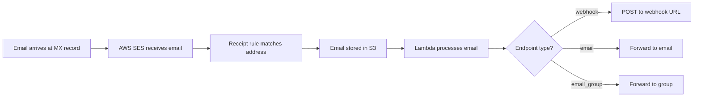

## Overview

Email addresses are the core primitive in Inbound - they're the actual `user@domain.com` addresses that receive emails and route them to your configured endpoints. Each email address belongs to a verified domain and can be connected to a webhook, email forward, or email group.

<Info>
Every email address in Inbound is associated with:
- A verified domain that you own
- An endpoint (webhook, email forward, or email group)
- AWS SES receipt rules that handle incoming mail
</Info>

## Schema Definition

From the database schema (`lib/db/schema.ts:113-127`):

```typescript
export const emailAddresses = pgTable('email_addresses', {
  id: varchar('id', { length: 255 }).primaryKey(),
  address: varchar('address', { length: 255 }).notNull().unique(),
  domainId: varchar('domain_id', { length: 255 }).notNull(),
  webhookId: varchar('webhook_id', { length: 255 }), // Legacy
  endpointId: varchar('endpoint_id', { length: 255 }), // New unified system
  isActive: boolean('is_active').default(true),
  isReceiptRuleConfigured: boolean('is_receipt_rule_configured').default(false),
  receiptRuleName: varchar('receipt_rule_name', { length: 255 }),
  tenantId: varchar('tenant_id', { length: 255 }), // SES tenant isolation
  createdAt: timestamp('created_at').defaultNow(),
  updatedAt: timestamp('updated_at').defaultNow(),
  userId: varchar('user_id', { length: 255 }).notNull(),
});
```

## Creating Email Addresses

### Using the SDK

```typescript
import { Inbound } from 'inboundemail'

const inbound = new Inbound(process.env.INBOUND_API_KEY!)

// Create an email address with a webhook endpoint
const emailAddress = await inbound.emailAddresses.create({
  address: 'support@yourdomain.com',
  domainId: 'dom_abc123',
  endpointId: 'endp_xyz789'
})

console.log(emailAddress)
// {
//   id: 'eml_def456',
//   address: 'support@yourdomain.com',
//   domainId: 'dom_abc123',
//   endpointId: 'endp_xyz789',
//   isActive: true,
//   isReceiptRuleConfigured: true,
//   receiptRuleName: 'batch-rule-001',
//   domain: {
//     id: 'dom_abc123',
//     name: 'yourdomain.com',
//     status: 'verified'
//   },
//   routing: {
//     type: 'endpoint',
//     id: 'endp_xyz789',
//     name: 'Support Webhook',
//     isActive: true
//   }
// }
```

### Direct API Request

From the implementation (`app/api/e2/email-addresses/create.ts:66-381`):

```bash
curl -X POST https://inbound.new/api/e2/email-addresses \
  -H "Authorization: Bearer ${INBOUND_API_KEY}" \
  -H "Content-Type: application/json" \
  -d '{
    "address": "support@yourdomain.com",
    "domainId": "dom_abc123",
    "endpointId": "endp_xyz789",
    "isActive": true
  }'
```

<Note>
The API automatically:
- Validates the domain belongs to you
- Checks the email domain matches the domain record
- Configures AWS SES receipt rules for email delivery
- Links the email address to the batch catch-all system
</Note>

## How Email Routing Works

### Routing Flow



1. **Email arrives** at your domain's MX record (AWS SES)
2. **SES receipt rule** matches the email address or catch-all domain
3. **Email is stored** in S3 with full content
4. **Lambda function** processes and parses the email
5. **Endpoint is triggered** based on routing configuration

### Endpoint Connection

Each email address can route to one endpoint:

```typescript
// Webhook endpoint - sends HTTP POST with email data
routing: {
  type: 'endpoint',
  id: 'endp_xyz789',
  name: 'Support Webhook',
  config: {
    url: 'https://yourapp.com/webhook/email',
    timeout: 30,
    retryAttempts: 3
  },
  isActive: true
}

// Email forward endpoint - forwards to another address
routing: {
  type: 'endpoint',
  id: 'endp_abc123',
  name: 'Team Forward',
  config: {
    forwardTo: 'team@company.com',
    preserveHeaders: true
  },
  isActive: true
}
```

## Listing Email Addresses

From the implementation (`app/api/e2/email-addresses/list.ts:72-275`):

```typescript
// List all email addresses
const addresses = await inbound.emailAddresses.list({
  limit: 50,
  offset: 0
})

// Filter by domain
const domainAddresses = await inbound.emailAddresses.list({
  domainId: 'dom_abc123'
})

// Filter by active status
const activeAddresses = await inbound.emailAddresses.list({
  isActive: true
})

// Filter by receipt rule configuration
const configuredAddresses = await inbound.emailAddresses.list({
  isReceiptRuleConfigured: true
})
```

### Response Structure

```typescript
{
  data: [
    {
      id: 'eml_def456',
      address: 'support@yourdomain.com',
      domainId: 'dom_abc123',
      endpointId: 'endp_xyz789',
      isActive: true,
      isReceiptRuleConfigured: true,
      receiptRuleName: 'batch-rule-001',
      createdAt: '2024-01-15T10:30:00Z',
      updatedAt: '2024-01-15T10:30:00Z',
      domain: {
        id: 'dom_abc123',
        name: 'yourdomain.com',
        status: 'verified'
      },
      routing: {
        type: 'endpoint',
        id: 'endp_xyz789',
        name: 'Support Webhook',
        isActive: true
      }
    }
  ],
  pagination: {
    limit: 50,
    offset: 0,
    total: 42,
    hasMore: false
  }
}
```

## AWS SES Receipt Rules

<Warning>
Inbound automatically manages AWS SES receipt rules for you. When you create an email address, it's added to a batch catch-all rule that handles incoming emails.
</Warning>

### Batch Rule System

From the implementation (`app/api/e2/email-addresses/create.ts:232-329`):

```typescript
// Inbound uses batch rules to efficiently manage email addresses
// Each batch rule can handle up to 500 domains/addresses
// Rules are automatically created and managed

const batchManager = new BatchRuleManager('inbound-catchall-domain-default')
const rule = await batchManager.findOrCreateRuleWithCapacity(1)

// Configuration applied:
{
  ruleName: 'batch-rule-001', // Auto-generated
  ruleSetName: 'inbound-catchall-domain-default',
  domainCount: 42, // Current capacity
  maxCapacity: 500, // AWS limit
  isActive: true
}
```

### Receipt Rule Configuration

When an email address is created, the system:

1. **Checks domain batch rule** - If domain not in batch system, adds it
2. **Configures Lambda action** - Routes emails to processing Lambda
3. **Configures S3 action** - Stores full email content in S3
4. **Updates database** - Marks email address as configured

```typescript
// Example receipt rule configuration
{
  domains: ['yourdomain.com'],
  lambdaFunctionArn: 'arn:aws:lambda:us-east-2:123456789:function:email-processor',
  s3BucketName: 'inbound-email-storage',
  ruleSetName: 'inbound-catchall-domain-default',
  ruleName: 'batch-rule-001'
}
```

## Managing Email Addresses

### Updating an Email Address

```typescript
// Update endpoint routing
const updated = await inbound.emailAddresses.update('eml_def456', {
  endpointId: 'endp_new123',
  isActive: true
})

// Disable an email address
const disabled = await inbound.emailAddresses.update('eml_def456', {
  isActive: false
})
```

### Deleting an Email Address

```typescript
// Delete removes from database and SES configuration
await inbound.emailAddresses.delete('eml_def456')
```

<Warning>
Deleting an email address:
- Removes it from the database
- Does NOT remove the domain from batch catch-all rules
- Emails to this address will still arrive but won't be routed
</Warning>

## Validation Rules

From the implementation (`app/api/e2/email-addresses/create.ts:84-144`):

```typescript
// Email format validation
const emailRegex = /^[^\s@]+@[^\s@]+\.[^\s@]+$/
if (!emailRegex.test(body.address)) {
  throw new Error('Invalid email address format')
}

// Domain ownership validation
const domainResult = await db
  .select()
  .from(emailDomains)
  .where(
    and(
      eq(emailDomains.id, body.domainId),
      eq(emailDomains.userId, userId)
    )
  )

if (!domainResult[0]) {
  throw new Error('Domain not found or access denied')
}

// Domain matching validation
const emailDomain = body.address.split('@')[1]
if (emailDomain !== domainResult[0].domain) {
  throw new Error(`Email must belong to domain ${domainResult[0].domain}`)
}

// Uniqueness validation
const existingEmail = await db
  .select()
  .from(emailAddresses)
  .where(eq(emailAddresses.address, body.address))

if (existingEmail[0]) {
  throw new Error('Email address already exists')
}
```

## Common Patterns

### Support Email with Webhook

```typescript
// Create endpoint
const endpoint = await inbound.endpoints.create({
  name: 'Support Webhook',
  type: 'webhook',
  config: {
    url: 'https://yourapp.com/api/support-webhook',
    timeout: 30,
    retryAttempts: 3
  }
})

// Create email address
const supportEmail = await inbound.emailAddresses.create({
  address: 'support@yourdomain.com',
  domainId: domain.id,
  endpointId: endpoint.id
})
```

### Team Alias with Email Group

```typescript
// Create email group endpoint
const teamEndpoint = await inbound.endpoints.create({
  name: 'Team Distribution',
  type: 'email_group',
  config: {
    emails: [
      'alice@company.com',
      'bob@company.com',
      'charlie@company.com'
    ],
    preserveHeaders: true
  }
})

// Create team email address
const teamEmail = await inbound.emailAddresses.create({
  address: 'team@yourdomain.com',
  domainId: domain.id,
  endpointId: teamEndpoint.id
})
```

### Forwarding to External Email

```typescript
// Create email forward endpoint
const forwardEndpoint = await inbound.endpoints.create({
  name: 'Forward to Gmail',
  type: 'email',
  config: {
    forwardTo: 'myemail@gmail.com',
    preserveHeaders: true
  }
})

// Create forwarding address
const forwardEmail = await inbound.emailAddresses.create({
  address: 'personal@yourdomain.com',
  domainId: domain.id,
  endpointId: forwardEndpoint.id
})
```

<Accordion title="FAQ">
  <AccordionItem title="Can I change an email address after creation?">
    No, the email address itself cannot be changed. You can update the endpoint it routes to, but to use a different address, you need to create a new email address and optionally delete the old one.
  </AccordionItem>

  <AccordionItem title="What happens if I delete an email address?">
    The email address is removed from the database and will stop routing emails. However, the domain remains in the batch catch-all rule, so emails may still be accepted by AWS SES but won't be processed or delivered to any endpoint.
  </AccordionItem>

  <AccordionItem title="Can multiple email addresses use the same endpoint?">
    Yes! Multiple email addresses can route to the same endpoint. This is useful when you want different email addresses to trigger the same webhook or forward to the same destination.
  </AccordionItem>

  <AccordionItem title="What's the difference between webhookId and endpointId?">
    `webhookId` is a legacy field from when webhooks were separate. `endpointId` is the new unified system that supports webhooks, email forwards, and email groups. Always use `endpointId` for new integrations.
  </AccordionItem>

  <AccordionItem title="How do I know if an email address is properly configured?">
    Check the `isReceiptRuleConfigured` field. If it's `true`, the AWS SES receipt rule is configured and the email address is ready to receive emails. You'll also see the `receiptRuleName` populated.
  </AccordionItem>

  <AccordionItem title="Can I have email addresses on subdomains?">
    Yes! If you have `example.com` verified, you can create email addresses like `support@mail.example.com`. The subdomain will inherit verification from the parent domain.
  </AccordionItem>
</Accordion>

## Best Practices

<Info>
**Email Address Organization**
- Use descriptive email addresses that match their purpose (`support@`, `billing@`, `team@`)
- Group related email addresses under the same domain
- Use endpoints to consolidate webhook logic instead of creating multiple webhooks
- Monitor `isActive` status to quickly enable/disable email routing
</Info>

<Warning>
**Rate Limits and Quotas**
- AWS SES has sending and receiving limits per account
- Batch catch-all rules have a 500 domain/address limit per rule
- Inbound automatically manages batch rules to stay within limits
- Consider your endpoint's capacity to handle incoming email volume
</Warning>

<Tip>
**Testing Email Addresses**
- Use the endpoint test feature to verify webhook delivery before creating email addresses
- Send test emails to verify end-to-end delivery
- Check the endpoint deliveries to monitor successful routing
- Use the `isActive` flag to temporarily disable problematic addresses
</Tip>
